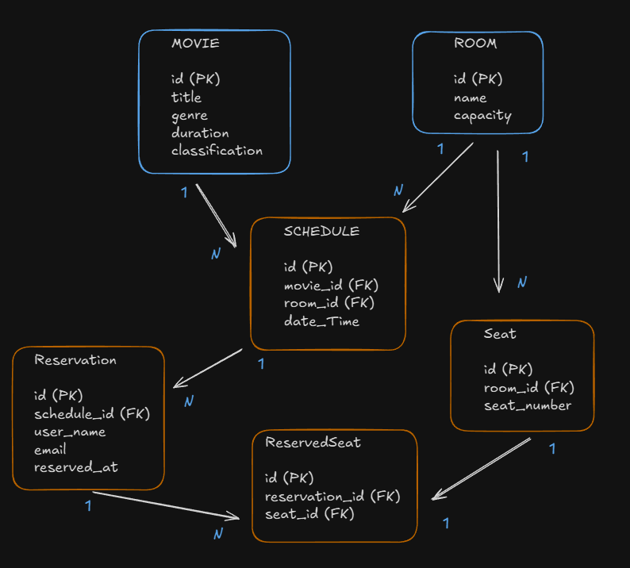

# CinemApp

CinemApp es una aplicación de reserva de cine que permite a los usuarios gestionar películas, salas, horarios y reservas.

## Requisitos previos

- Node.js (v20 o superior)

## Estructura del proyecto

- `CinemaBookingApp`: Aplicación frontend construida con React y Bootstrap.
- `cinema-reservation-management`: API backend construida con Node.js, TS y Express.

## Comenzando

### 1. Clonar el repositorio

```bash
git clone https://github.com/yourusername/CinemApp.git
cd CinemApp
```

### 2. Configurar y iniciar la API backend

Navega al directorio `cinema-reservation-management` e instala las dependencias:

```bash
cd cinema-reservation-management
npm install
```

Crea un archivo `.env` en el directorio `cinema-reservation-management` y agrega las siguientes variables de entorno:

```
DB_USER=postgres
DB_HOST=
DB_NAME=cinemadb
DB_PASSWORD=
DB_PORT=5432
PORT=3000
SMTP_USERNAME=
SMTP_PASSWORD=
```

Inicia el servidor backend:

```bash
npm run dev
```

La API backend estará ejecutándose en `http://localhost:3000`.

### 3. Configurar e iniciar la aplicación frontend

Navega al directorio `CinemaBookingApp` e instala las dependencias:

```bash
cd ../CinemaBookingApp
npm install
```
Inicia la aplicación frontend:

```bash
npm run dev
```
La aplicación frontend estará ejecutándose en `http://localhost:5173/`.

## Uso

- Abre tu navegador y navega a `http://localhost:3001` para acceder al frontend de CinemApp.
- Usa la aplicación para gestionar películas, salas, horarios y reservas.

## Endpoints de la API

### Películas

- `GET /movies`: Obtener todas las películas
- `GET /movies/:id`: Obtener una película por ID
- `POST /movies`: Crear una nueva película
- `PUT /movies/:id`: Actualizar una película
- `DELETE /movies/:id`: Eliminar una película

### Salas

- `GET /rooms`: Obtener todas las salas
- `GET /rooms/:id`: Obtener una sala por ID
- `POST /rooms`: Crear una nueva sala
- `PUT /rooms/:id`: Actualizar una sala
- `DELETE /rooms/:id`: Eliminar una sala

### Horarios

- `GET /schedules`: Obtener todos los horarios
- `POST /schedules`: Crear un nuevo horario
- `PUT /schedules/:id`: Actualizar un horario
- `DELETE /schedules/:id`: Eliminar un horario

### Reservas

- `GET /reservations`: Obtener todas las reservas
- `POST /reservations`: Crear una nueva reserva
- `DELETE /reservations/:id`: Eliminar una reserva

### Diagrama DB


## Contribuyendo

¡Las contribuciones son bienvenidas! Por favor, abre un issue o envía un pull request para cualquier cambio.

## Licencia

Este proyecto está licenciado bajo la Licencia MIT.
